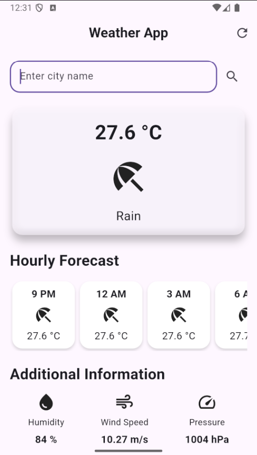

# 🌤️ Flutter Weather App

A beautifully designed weather app built with Flutter. It displays current temperature, weather conditions, hourly forecasts, and additional weather metrics like humidity, wind speed, and pressure — all in a clean and minimal UI.



---

## 🚀 Features

- 📍 Current temperature and weather condition
- ⏰ Hourly weather forecast
- 🌡️ Additional info: humidity, wind speed, pressure
- 🔄 Pull-to-refresh functionality
- 🌙 Dark mode UI
- 🔧 Easily pluggable with weather APIs (like OpenWeatherMap)

---

## 🛠️ Tech Stack

- **Flutter** – UI toolkit
- **Dart** – Language
- **OpenWeatherMap API** – Weather data

---

## 📦 Packages Used

```yaml
flutter:
  sdk: flutter

dependencies:
  flutter:
    sdk: flutter
  lucide_icons: ^0.2.0
